# 🕵️ Hidden Agents — Reddit Undercover

> **A social deduction game built for Reddit's [Games with a Hook Hackathon](https://redditgameswithahook.devpost.com/).** Players join a match from their Reddit feed, receive secret roles, and work together to uncover the Spy through night-time investigations, heated discussion, and group votes.

---

## Screenshots

<table>
  <tr>
    <td align="center">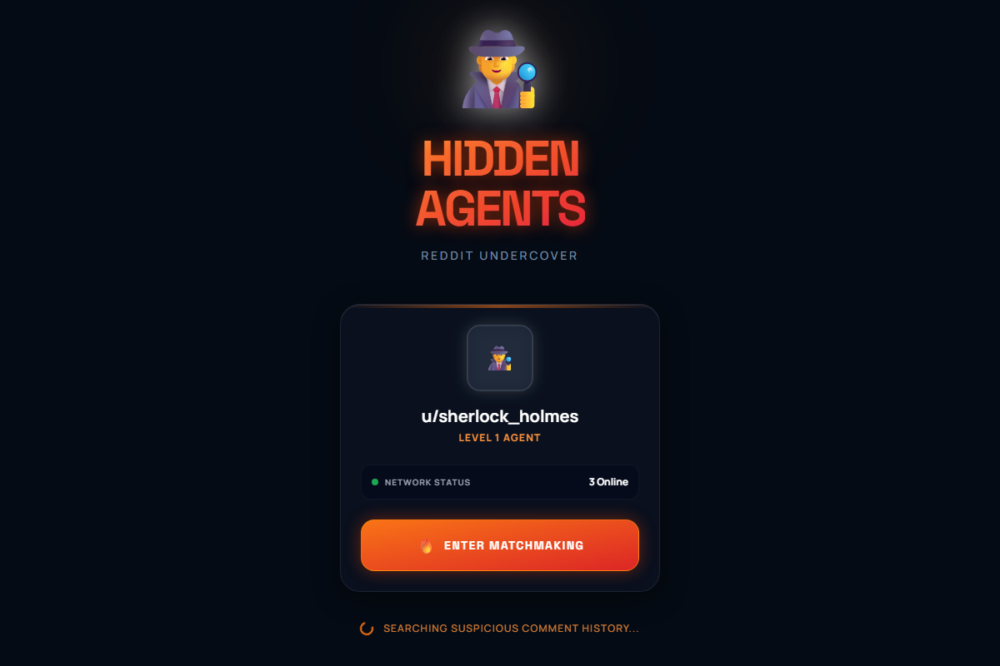<br/><b>Splash</b></td>
    <td align="center">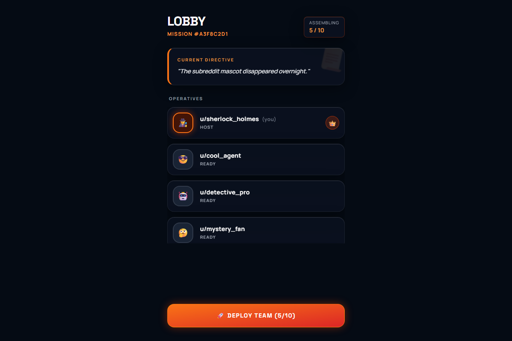<br/><b>Lobby</b></td>
  </tr>
  <tr>
    <td align="center">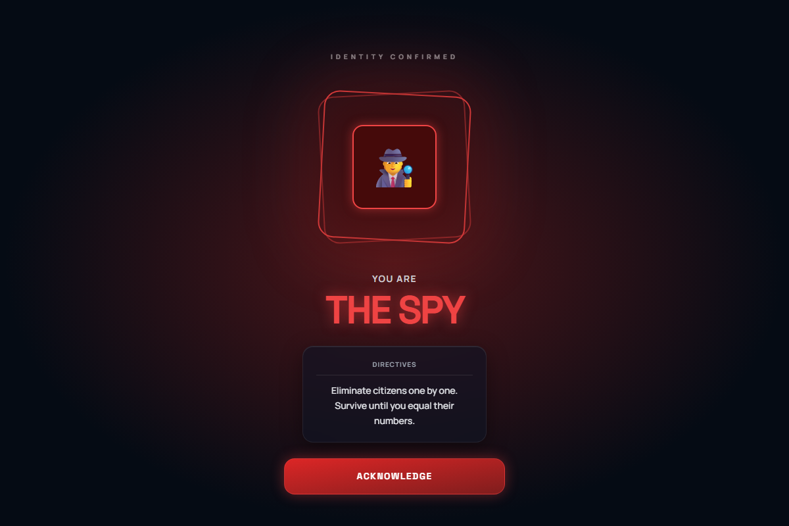<br/><b>Role Reveal: Spy</b></td>
    <td align="center">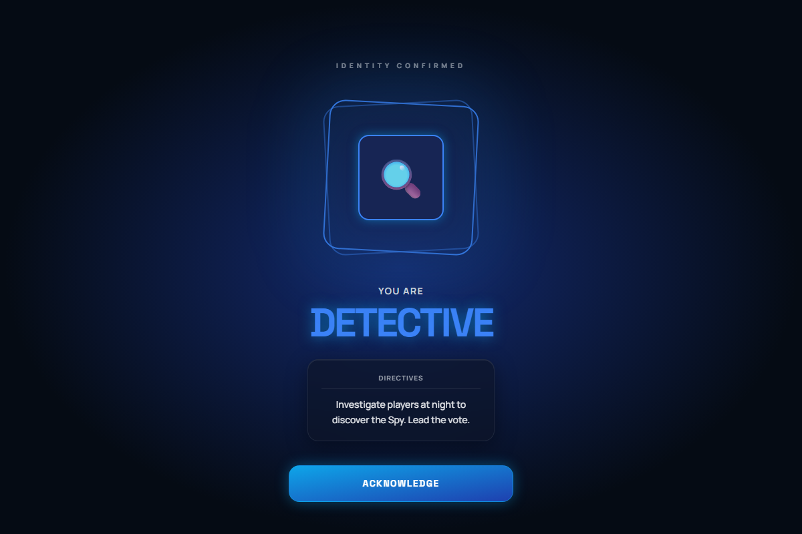<br/><b>Role Reveal: Detective</b></td>
  </tr>
  <tr>
    <td align="center">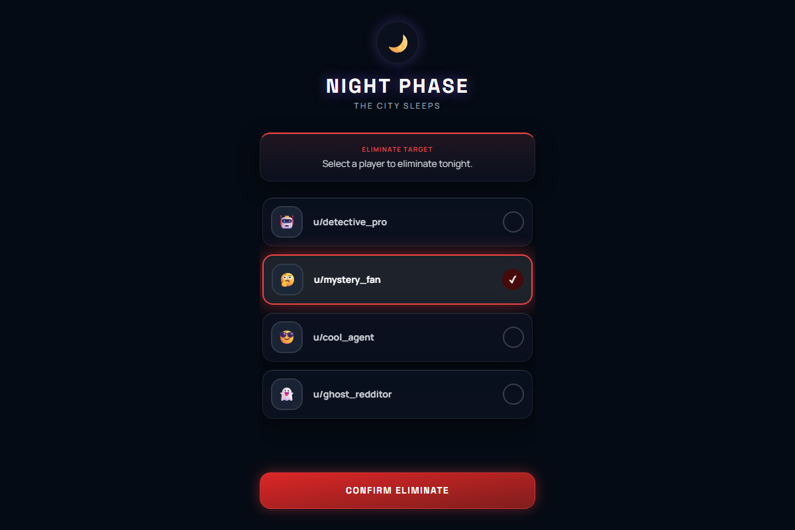<br/><b>Night Phase (Spy)</b></td>
    <td align="center">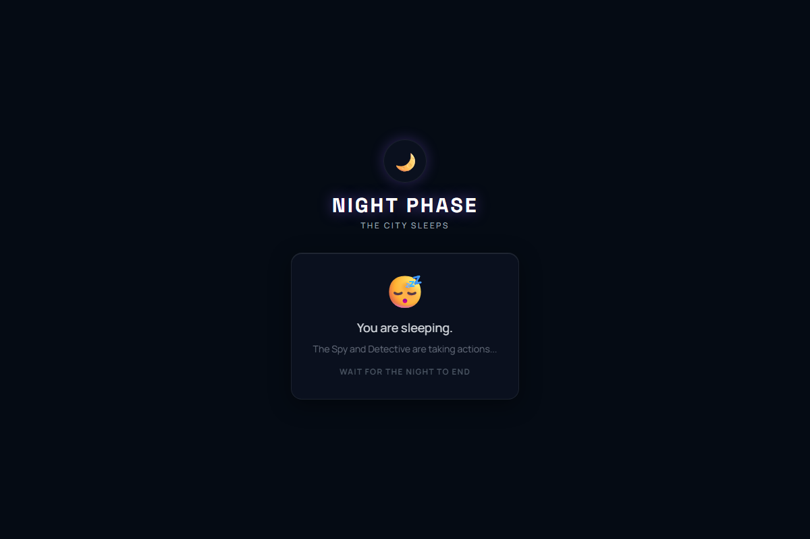<br/><b>Night Phase (Citizen)</b></td>
  </tr>
  <tr>
    <td align="center">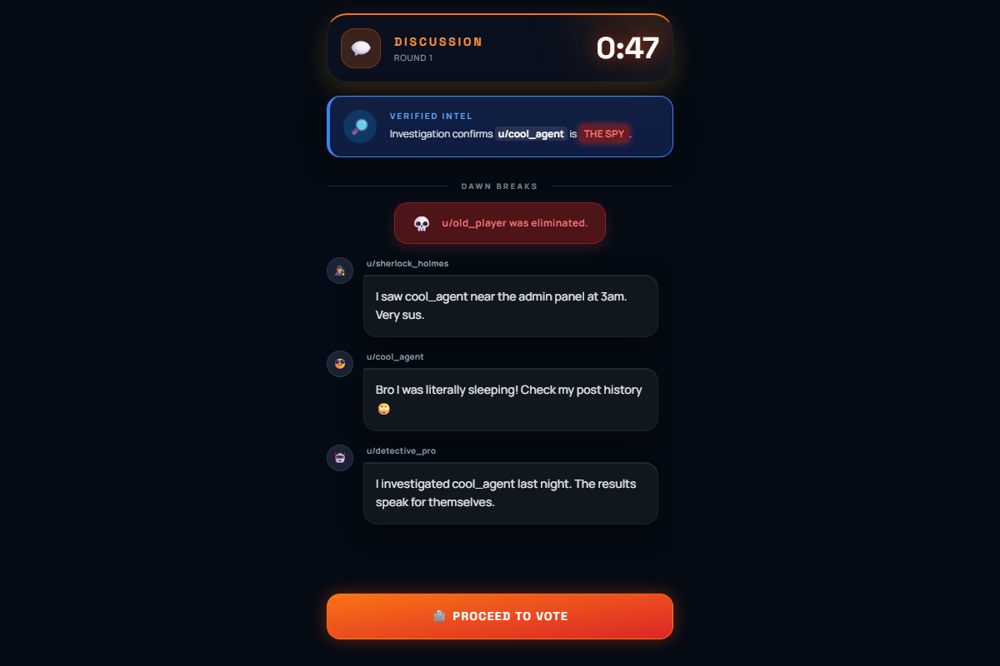<br/><b>Discussion</b></td>
    <td align="center">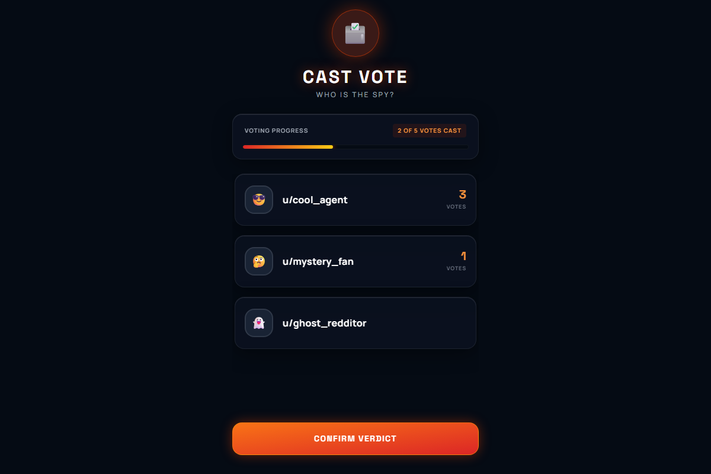<br/><b>Voting</b></td>
  </tr>
  <tr>
    <td align="center">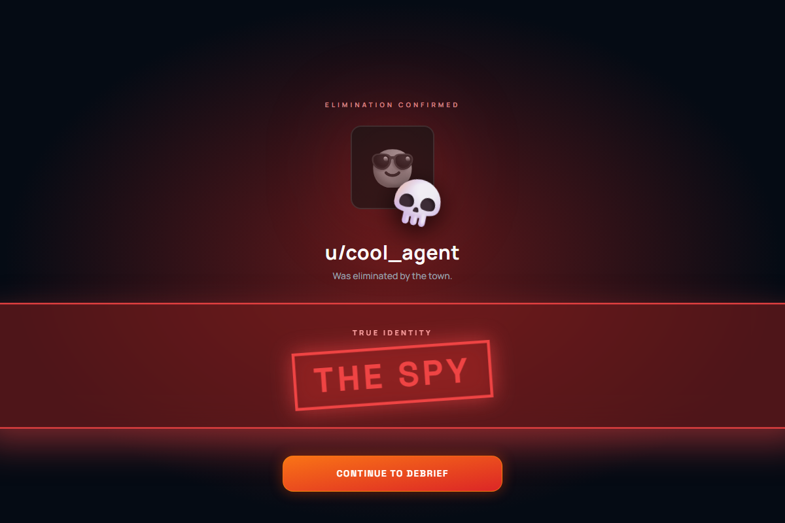<br/><b>Elimination Reveal</b></td>
    <td align="center">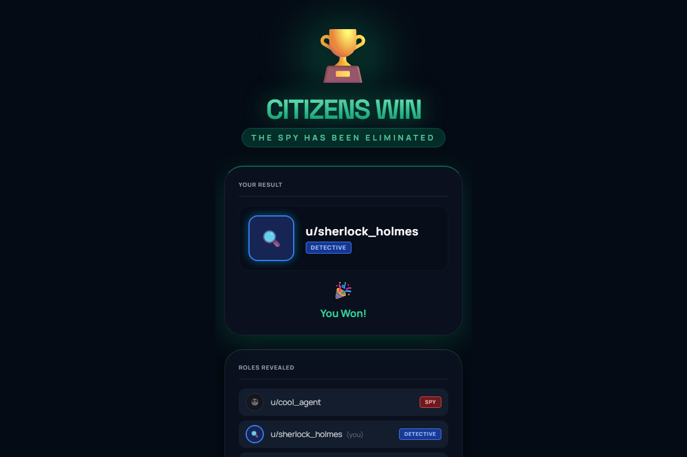<br/><b>Game End</b></td>
  </tr>
  <tr>
    <td align="center" colspan="2">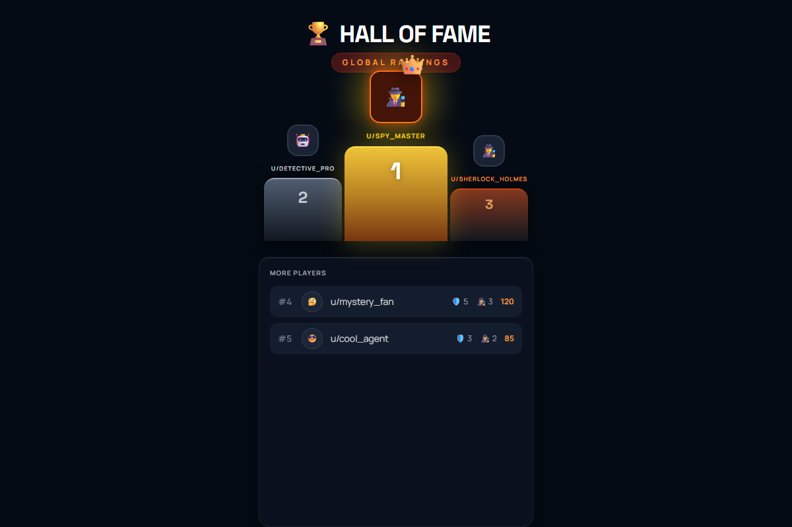<br/><b>Global Leaderboard</b></td>
  </tr>
</table>

---

## 🎮 The Hook — Why Players Come Back

Hidden Agents is designed around **daily social rituals** that pull Redditors back:

| Retention Mechanic | How It Works |
|---|---|
| **Daily Mystery** | Each day features a fresh mystery prompt, giving players a reason to check in |
| **Ranked Leaderboard** | Persistent global rankings with ELO-style scoring reward consistent play |
| **Role Mastery** | Track wins as Spy vs. Detective vs. Citizen — each role has its own satisfaction loop |
| **Social Betrayal** | The core loop of suspicion, accusation, and voting creates organic Reddit-style conversation |
| **Community Identity** | Players build reputations as trusted Detectives or feared Spies across sessions |

---

## 🕵️ How to Play

1. **Join the Lobby** — Click "Enter Matchmaking" to join a game in your subreddit feed
2. **Role Reveal** — You're assigned one of three secret roles:
   - 🕵️ **Spy** — Eliminate citizens one by one at night without being caught
   - 🔍 **Detective** — Investigate a player each night to discover the Spy
   - 👤 **Citizen** — Discuss, share intel, and vote to identify the Spy
3. **Night Phase** — Spy eliminates a target; Detective investigates a suspect; Citizens sleep
4. **Discussion** — Share what you know, accuse suspects, build alliances (just like a Reddit thread)
5. **Vote** — Cast your vote to eliminate the player you suspect is the Spy
6. **Win Conditions**:
   - **Citizens win** by voting out the Spy
   - **Spy wins** when their numbers equal the remaining citizens

---

## 🏗️ What Makes It Reddit-y

- **Built as a Devvit app** — lives natively in Reddit feeds as an Interactive Post
- **Comment-driven discussion** — the Discussion phase pulls in real Reddit comments from the post thread, making the game feel like a genuine community event
- **Community-first design** — no account creation needed; your Reddit identity is your game identity
- **Subreddit-native** — each subreddit can host its own games, creating organic communities around play
- **Social deduction meets Reddit culture** — the accusation/debate/vote loop mirrors how Redditors already interact

---

## 🛠️ Tech Stack

| Layer | Technology |
|---|---|
| **Platform** | [Devvit Web](https://developers.reddit.com/) — Reddit's developer platform |
| **Frontend** | [React 19](https://react.dev/) + [Tailwind CSS 4](https://tailwindcss.com/) |
| **Backend** | [Hono](https://hono.dev/) — lightweight, edge-ready API framework |
| **Type Safety** | [TypeScript](https://www.typescriptlang.org/) end-to-end via [tRPC v11](https://trpc.io/) |
| **Build** | [Vite](https://vite.dev/) |
| **Design System** | Custom glassmorphism UI with animated particle backgrounds |

---

## 🎯 Hackathon Alignment

| Judging Criteria | How Hidden Agents Delivers |
|---|---|
| **Delightful UX** | Glassmorphism design, cinematic role reveals, animated particle backgrounds, glow effects — every screen feels premium |
| **Polish** | Full game loop with 11 distinct screens, responsive mobile layout, smooth animations, error handling, and loading states |
| **Reddit-y** | Native Devvit app, Reddit identity integration, comment-driven discussion, subreddit-hosted games |
| **Hook-y** | Daily mysteries, persistent leaderboard, role mastery tracking, social betrayal loop that creates organic replayability |

---

## 🚀 Getting Started

```bash
# Install dependencies
npm install

# Start development server
npm run dev

# Build for production
npm run build

# Deploy to Reddit
npm run deploy

# Publish for review
npm run launch

# Type check
npm run type-check
```

---

## 📁 Project Structure

```
src/
├── client/                  # Frontend (runs in Reddit iframe)
│   ├── components/
│   │   └── DesignSystem.tsx  # Glassmorphism UI, avatars, buttons, backgrounds
│   ├── hooks/
│   │   └── useGameState.ts   # Game state management via tRPC
│   ├── screens/
│   │   ├── Lobby.tsx         # Player lobby with live updates
│   │   ├── RoleReveal.tsx    # Cinematic role assignment
│   │   ├── NightPhase.tsx    # Spy elimination / Detective investigation
│   │   ├── DiscussionPhase.tsx  # Reddit comment-driven debate
│   │   ├── VotingPhase.tsx   # 3D card-flip voting UI
│   │   ├── EliminationReveal.tsx  # Dramatic elimination reveal
│   │   ├── GameEnd.tsx       # Win/loss screen with role reveals
│   │   └── Leaderboard.tsx   # Global rankings with podium
│   ├── game.tsx              # Main game entry point
│   └── splash.tsx            # Entry point shown in Reddit feed
├── server/                  # Backend (Devvit serverless)
│   ├── trpc.ts               # tRPC router definitions
│   └── index.ts              # Hono API server
└── shared/                   # Shared types between client/server
```

---

## 📄 License

MIT

---

*Built for [Reddit's Games with a Hook Hackathon](https://redditgameswithahook.devpost.com/) — July 2026*
